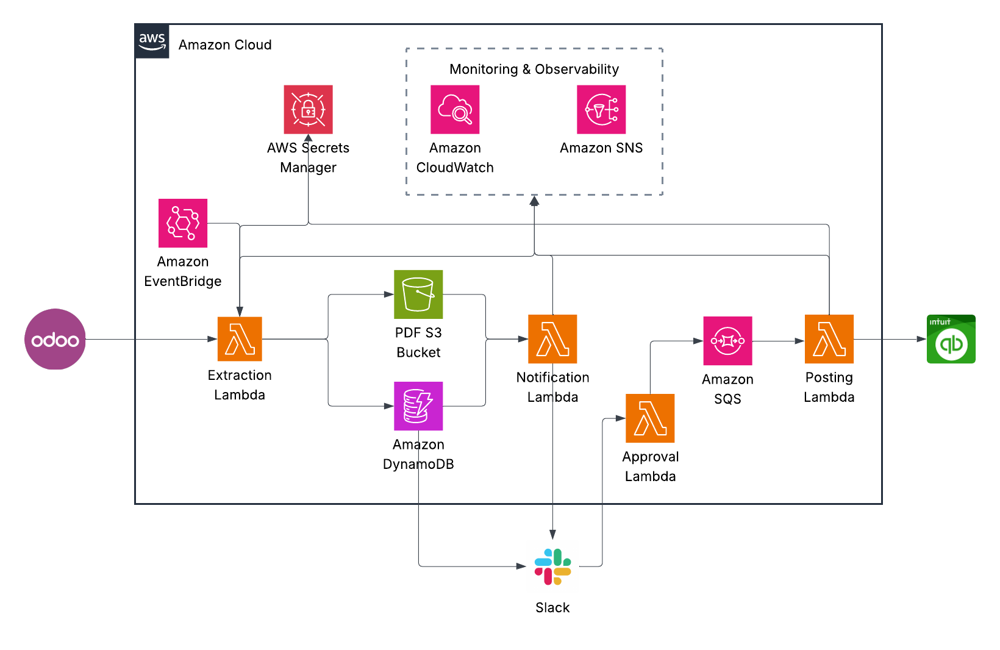

## Odoo → QuickBooks Integration (Serverless)

Automated, approval-based pipeline that extracts vendor bills from Odoo, routes them to Slack for finance approval, and posts approved invoices to QuickBooks. It uses four AWS Lambda functions orchestrated by EventBridge (schedule), DynamoDB Streams, a Lambda Function URL (for Slack interactivity), and SQS. DynamoDB tracks state, Secrets Manager stores credentials, and CloudWatch/SNS provide observability.



### Architecture

- Odoo Extractor (Lambda):
  - Scheduled by EventBridge (`rate(...)`)
  - Reads Odoo credentials from AWS Secrets Manager
  - Fetches posted vendor bills and validates data
  - Uploads PDFs to S3 under `pending/<company>/<entry_id>.pdf`
  - Writes records to DynamoDB with `status=READY_FOR_APPROVAL`
  - Publishes failure alerts to SNS
- Slack Notifier (Lambda):
  - Triggered by DynamoDB Streams on new `READY_FOR_APPROVAL` records
  - Builds Slack Block Kit message with invoice details + Approve/Reject buttons
  - Posts to a configured Slack channel and records the Slack message timestamp
- Approval Handler (Lambda Function URL):
  - Target for Slack interactive button clicks (Approve/Reject/View PDF)
  - Verifies Slack signing secret, updates DynamoDB status
  - On Approve: enqueues invoice to SQS for posting
- QuickBooks Poster (Lambda):
  - Triggered by SQS messages for approved invoices
  - Reads QuickBooks OAuth credentials from Secrets Manager
  - Posts invoices into QuickBooks and updates DynamoDB
- Observability and Safety:
  - CloudWatch Logs per Lambda
  - CloudWatch Alarms for DLQ message visibility
  - SNS topic for email alerts

---

## Terraform Infrastructure (`main.tf`)

This configuration provisions:

- S3 bucket for invoice PDFs (versioned, encrypted, lifecycle rules)
- DynamoDB table for invoice metadata/state with Streams enabled
  - PK: `entry_id`; GSIs: `status` and `company+status`; TTL + PITR
- Secrets Manager secrets + versions populated from Terraform variables:
  - `odoo-qb-integration/odoo-credentials-<env>`
  - `odoo-qb-integration/quickbooks-credentials-<env>`
  - `odoo-qb-integration/slack-config-<env>`
- IAM roles/policies for Lambdas (Logs, S3, DynamoDB, Secrets, SNS, SQS)
- Lambda functions (Python 3.12):
  - `odoo-extractor-<env>` (300s, 512 MB) — EventBridge scheduled
  - `odoo-notifier-<env>` (30s, 256 MB) — DynamoDB Stream triggered
  - `odoo-approval-handler-<env>` (30s, 256 MB) — Function URL (Slack)
  - `odoo-poster-<env>` (300s, 256 MB) — SQS triggered
- SQS queue for approved invoices + DLQ for poster
- EventBridge rule and target for scheduled extraction
- CloudWatch Log Groups and DLQ alarms
- SNS topic + email subscription for alerts
- Outputs for key resource names/ARNs and the approval Function URL

### Key Variables

- `aws_region` (default: `us-west-2`)
- `environment` (default: `prod`)
- `odoo_api_url` (default: `https://scalemedia.odoo.com`)
- `alert_email` (required): email recipient for alerts
- `schedule_rate` (default: `rate(15 minutes)`)
- Slack:
  - `slack_channel_id` (required): Slack channel ID for notifications
  - `slack_bot_token` (sensitive): Slack Bot OAuth token (`xoxb-...`)
  - `slack_signing_secret` (sensitive): Slack signing secret
- Odoo:
  - `odoo_database`, `odoo_username`, `odoo_api_key` (sensitive)
- QuickBooks:
  - `qb_client_id`, `qb_client_secret` (sensitive)
  - `qb_refresh_token` (sensitive)
  - `qb_realm_ids` (map of company → realm ID)
  - `qb_use_sandbox` (bool, default `false`)

Secrets payloads are generated from these variables and stored in Secrets Manager by Terraform.

---

## Lambda Functions

- Extractor (`extractor.lambda_handler`)
  - Env: `ENVIRONMENT`, `ODOO_API_URL`, `ODOO_SECRET_ARN`, `DYNAMODB_TABLE`, `S3_BUCKET`, `SNS_ALERT_TOPIC`
- Notifier (`notifier.lambda_handler`)
  - Env: `ENVIRONMENT`, `SLACK_SECRET_ARN`, `SLACK_CHANNEL_ID`, `DYNAMODB_TABLE`, `S3_BUCKET`, `APPROVAL_URL`
- Approval Handler (`approval_handler.lambda_handler`)
  - Env: `ENVIRONMENT`, `DYNAMODB_TABLE`, `SQS_QUEUE_URL`, `SLACK_SECRET_ARN`
- Poster (`poster.lambda_handler`)
  - Env: `ENVIRONMENT`, `QB_SECRET_ARN`, `DYNAMODB_TABLE`, `S3_BUCKET`, `SNS_ALERT_TOPIC`

All functions publish logs to CloudWatch. Poster and Extractor have DLQs/alarms configured via SQS.

---

## Build and Deploy

Prerequisites:
- Terraform >= 1.0
- AWS CLI configured for the target account/region
- Python 3.12 with `pip` and `zip` available
- Bash shell to run the build script

### Configure Variables

Create or update `terraform.tfvars` (example):

```hcl
aws_region    = "us-west-2"
environment   = "prod"

# Core
odoo_api_url       = "https://scalemedia.odoo.com"
schedule_rate      = "rate(15 minutes)"
alert_email        = "finance-alerts@company.com"

# Slack
slack_channel_id    = "C0123456789"
slack_bot_token     = "xoxb-***"
slack_signing_secret = "********"

# Odoo
odoo_database = "2jaszgithub-scale-media-master-305444"
odoo_username = "finance-automation@company.com"
odoo_api_key  = "********"

# QuickBooks
qb_client_id     = "********"
qb_client_secret = "********"
qb_refresh_token = "********"
qb_realm_ids = {
  "1MD"               = "1234567890"
  "LiveConscious"     = "2345678901"
  "EssentialElements" = "3456789012"
  "TruAlchemy"        = "4567890123"
}
qb_use_sandbox = false
```

Terraform will create/update the Secrets Manager values from these variables.

### Package Lambda Code

```bash
./build.sh
```

This produces:
- `lambda/extractor.zip`
- `lambda/notifier.zip`
- `lambda/approval_handler.zip`
- `lambda/poster.zip`

### Apply Infrastructure

```bash
terraform init
terraform plan -out tfplan
terraform apply tfplan
```

Terraform outputs include:
- `approval_handler_url` (configure this as the Slack interactivity endpoint)
- S3 bucket name
- DynamoDB table name
- SQS queue URL for approved invoices
- Names/ARNs for Lambdas and Secrets
- SNS alerts topic ARN

---

## Operations

- Logs:
  - `/aws/lambda/odoo-extractor-<env>`
  - `/aws/lambda/odoo-notifier-<env>`
  - `/aws/lambda/odoo-approval-handler-<env>`
  - `/aws/lambda/odoo-poster-<env>`
- Data flow:
  - Extractor writes PDFs to `s3://<bucket>/pending/<company>/<entry_id>.pdf`
  - Extractor writes `READY_FOR_APPROVAL` items to DynamoDB
  - Notifier (DDB Stream) sends Slack Approve/Reject
  - Approval Handler updates status and enqueues SQS
  - Poster consumes SQS, posts to QuickBooks, updates DynamoDB
- Alerts and Health:
  - SNS email on alarms
  - CloudWatch Alarms on DLQ `ApproximateNumberOfMessagesVisible > 0`

### Manual Invocation (ad-hoc)

Invoke the extractor (e.g., to pull immediately):

```bash
aws lambda invoke --function-name odoo-extractor-<env> --region <region> response.json
```

Test the approval handler (ensure Slack signature disabled in dev or provide proper headers):

```bash
curl -X POST "<approval_handler_url>" --data-urlencode 'payload={"type":"block_actions","user":{"id":"U123","username":"tester"},"actions":[{"action_id":"approve_invoice","value":"<entry_id>"}],"response_url":"https://hooks.slack.com/actions/..."}'
```

---

## Security and Access

- S3 bucket is encrypted at rest (SSE-S3) and blocks public access
- Secrets are stored in AWS Secrets Manager; Lambdas read only what they need
- IAM follows least privilege across S3, DynamoDB, Secrets, Logs, SNS, SQS
- DynamoDB has PITR enabled; table entries use TTL for lifecycle management

---

## Troubleshooting

- No PDFs in S3:
  - Verify Odoo credentials and `odoo_api_url`
  - Check extractor Lambda logs for API/permission errors
  - Ensure schedule is correct and function has executed
- Slack notifications not appearing:
  - Verify `slack_bot_token`, `slack_channel_id`, and Function URL in Notifier env
  - Ensure DynamoDB Stream is enabled and event source mapping is `Enabled`
  - Check Notifier logs for Slack API errors
- Approval clicks failing:
  - Confirm `approval_handler_url` is configured as the Slack Interactivity endpoint
  - Verify Slack signing secret and request signature validation
  - Check Approval Handler logs for payload parsing/validation errors
- SQS not triggering poster:
  - Ensure Poster’s event source mapping is `Enabled`
  - Check SQS queue for visible messages and Poster logs for processing
- QuickBooks posting fails:
  - Verify QuickBooks client credentials, refresh token, realm IDs, and sandbox flag
  - Inspect Poster logs and DLQ for message details
- Alarms firing:
  - Check CloudWatch Logs, DLQ contents, and Secrets validity

---

## Repository Layout

- `main.tf` — AWS resources (S3, DynamoDB+Streams, Secrets, IAM, Lambdas, EventBridge, SQS, Alarms, SNS, outputs)
- `build.sh` — builds Lambda deployment zips
- `lambda/` — Lambda sources and requirements
  - `extractor.py`
  - `notifier.py`
  - `approval_handler.py`
  - `poster.py`
  - `requirements.txt`
- `terraform.tfvars.example` — example variable values (do not commit secrets)
- `README.md` — this file