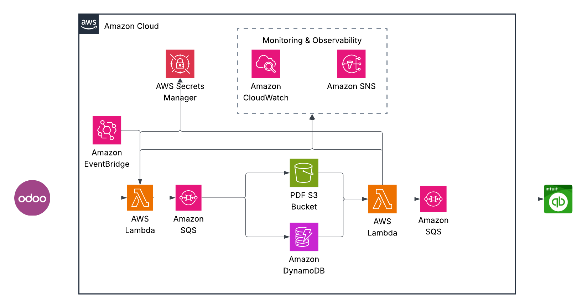

## Odoo → QuickBooks Integration (Serverless)

Automated, scheduled pipeline that pulls invoices/bills from Odoo and posts them to QuickBooks. It uses two AWS Lambda functions orchestrated by EventBridge (schedule) and S3 (event notifications), with DynamoDB for state tracking, Secrets Manager for credentials, SNS/Slack for alerts, and DLQs for resilience.



### Architecture

- Odoo Extractor (Lambda):
  - Scheduled by EventBridge (`rate(...)`)
  - Reads Odoo credentials from AWS Secrets Manager
  - Fetches new invoices/bills and metadata from the Odoo API
  - Stores tracking records in DynamoDB
  - Writes invoice PDFs to S3 under `pending/`
  - Publishes alerts to SNS (and optional Slack webhook)
- QuickBooks Poster (Lambda):
  - Triggered by S3 ObjectCreated events for keys with prefix `pending/` and suffix `.pdf`
  - Reads OAuth credentials from Secrets Manager
  - Posts documents/entries to QuickBooks
  - Updates statuses in DynamoDB
  - May copy/move/delete objects in S3 as part of post-processing
- Observability and Safety:
  - CloudWatch Logs for both functions
  - CloudWatch Alarms on Lambda errors and on DLQ message visibility
  - SQS Dead Letter Queues per Lambda
  - SNS topic for email alerts; optional Slack webhook for additional notifications

---

## Terraform Infrastructure (`main.tf`)

This configuration provisions:

- S3 bucket for invoice PDFs (versioned, encrypted, lifecycle rules; S3 → Lambda trigger on `pending/*.pdf`)
- DynamoDB for invoice metadata/state (`entry_id` PK, GSIs on `status` and `company+status`, TTL, PITR)
- Secrets Manager secrets:
  - `odoo-qb-integration/odoo-credentials-<env>`
  - `odoo-qb-integration/quickbooks-credentials-<env>`
- IAM roles and inline policies for both Lambdas (logs, S3, DynamoDB, Secrets, SNS, SQS)
- Lambda functions:
  - `odoo-extractor-<env>` (Python 3.12, 300s, 512 MB)
  - `qb-poster-<env>` (Python 3.12, 120s, 256 MB)
- EventBridge rule and target for scheduled Odoo polling
- CloudWatch Log Groups and Alarms (Lambda errors, SQS DLQs)
- SQS Dead Letter Queues for both Lambdas
- SNS topic plus email subscription for alerts
- Outputs for key resource names/ARNs

### Key Variables

- `aws_region` (default: `us-west-2`)
- `environment` (default: `prod`)
- `odoo_api_url` (default: `https://scalemedia.odoo.com`)
- `alert_email` (required): email recipient for alerts
- `schedule_rate` (default: `rate(15 minutes)`)
- `slack_webhook_url` (optional, default: empty)

Secrets (stored out-of-band in Secrets Manager):

- Odoo credentials JSON:

```json
{"database": "...", "username": "...", "password": "..."}
```

- QuickBooks OAuth JSON:

```json
{"client_id": "...", "client_secret": "...", "refresh_token": "...", "realm_ids": {"companyA": "12345", "companyB": "67890"}}
```

---

## Lambda Functions

- Odoo Extractor (`odoo_extractor.lambda_handler`)
  - Env: `ENVIRONMENT`, `ODOO_API_URL`, `ODOO_SECRET_ARN`, `DYNAMODB_TABLE`, `S3_BUCKET`, `SNS_ALERT_TOPIC`, `SLACK_WEBHOOK_URL`
- QuickBooks Poster (`qb_poster.lambda_handler`)
  - Env: `ENVIRONMENT`, `QB_SECRET_ARN`, `DYNAMODB_TABLE`, `S3_BUCKET`, `SNS_ALERT_TOPIC`, `SLACK_WEBHOOK_URL`

Both functions publish logs to CloudWatch and route failures to their respective DLQs.

---

## Build and Deploy

Prerequisites:
- Terraform >= 1.0
- AWS CLI configured for the target account/region
- Python 3.12 with `pip` and `zip` available
- Bash shell to run the build script

### Configure Variables

Create or update `terraform.tfvars` (example):

```hcl
aws_region    = "us-west-2"
environment   = "prod"

# Odoo
odoo_api_url  = "https://scalemedia.odoo.com"

# Alerts
alert_email   = "data-engineering@scalemedia.com"

# Schedule
schedule_rate = "rate(15 minutes)"

# Optional: Slack webhook for alerts
slack_webhook_url = ""
```

Add secret values in AWS Secrets Manager (not in Terraform state). See JSON examples above.

### Package Lambda Code

```bash
./build.sh
```

This produces:
- `lambda/odoo_extractor.zip`
- `lambda/qb_poster.zip`

### Apply Infrastructure

```bash
terraform init
terraform plan -out tfplan
terraform apply tfplan
```

Terraform outputs include:
- S3 bucket name
- DynamoDB table name
- Odoo extractor Lambda function name
- QuickBooks poster Lambda function name
- Odoo/QB secret ARNs
- SNS alerts topic ARN

---

## Operations

- Logs:
  - `/aws/lambda/odoo-extractor-<env>`
  - `/aws/lambda/qb-poster-<env>`
- S3 layout (ingress):
  - `s3://<bucket>/pending/*.pdf` (triggers the QuickBooks poster)
- DynamoDB table:
  - `odoo-qb-invoices-<env>` tracks status, company, TTL
- Alerts and Health:
  - SNS email on alarms
  - Optional Slack webhook notifications
  - CloudWatch Alarms on Lambda `Errors > 0`
  - DLQ alarms on `ApproximateNumberOfMessagesVisible > 0`

### Manual Invocation (ad-hoc)

Invoke the extractor (e.g., to pull immediately):

```bash
aws lambda invoke --function-name odoo-extractor-<env> --region <region> response.json
```

---

## Security and Access

- S3 bucket is encrypted at rest (SSE-S3) and blocks public access
- Secrets are stored in AWS Secrets Manager; Lambdas read only what they need
- IAM follows least privilege across S3, DynamoDB, Secrets, Logs, SNS, SQS
- DynamoDB has PITR enabled; table entries use TTL for lifecycle management

---

## Troubleshooting

- No PDFs in S3:
  - Verify Odoo credentials JSON and `odoo_api_url`
  - Check extractor Lambda logs for API/permission errors
  - Ensure schedule is correct and function has executed
- QuickBooks posting fails:
  - Verify QuickBooks OAuth JSON (client id/secret, refresh token, realm IDs)
  - Check poster Lambda logs for API errors
  - Inspect DLQs for message details
- Alarms firing:
  - Check CloudWatch Logs, DLQ contents, and Secrets validity
- S3 event not triggering poster:
  - Ensure object key matches `pending/*.pdf`
  - Confirm Lambda permission for S3 invoke and bucket notification exists

---

## Repository Layout

- `main.tf` — AWS resources (S3, DynamoDB, Secrets, IAM, Lambdas, EventBridge, Alarms, DLQs, SNS, outputs)
- `build.sh` — builds Lambda deployment zips
- `lambda/` — Lambda sources and requirements
  - `odoo_extractor.py`
  - `qb_poster.py`
  - `requirements.txt`
- `terraform.tfvars.example` — example variable values (do not commit secrets)
- `README.md` — this file

